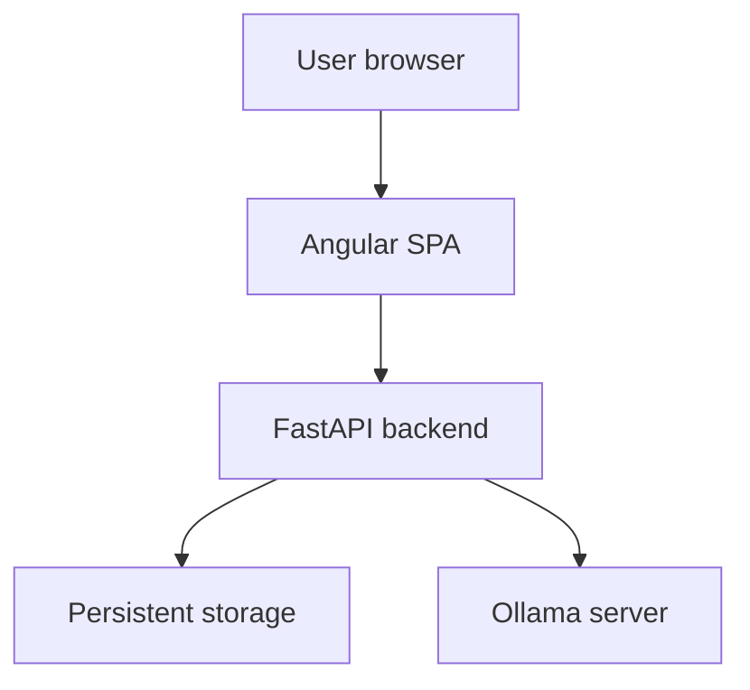
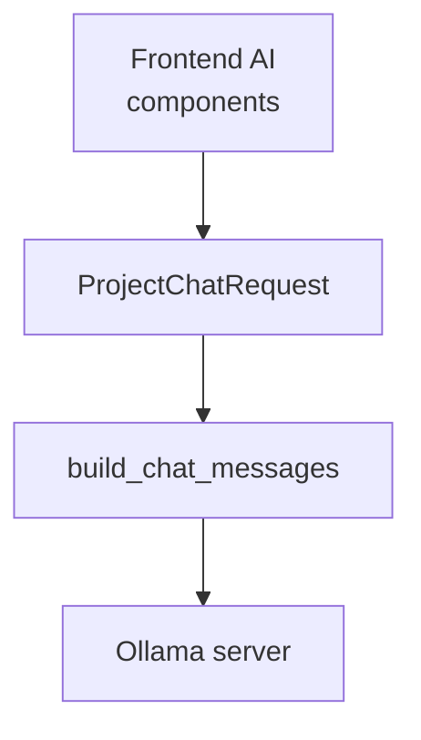
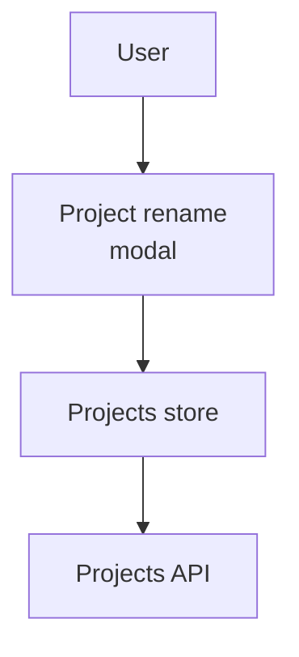
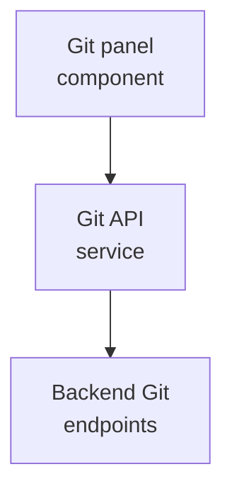
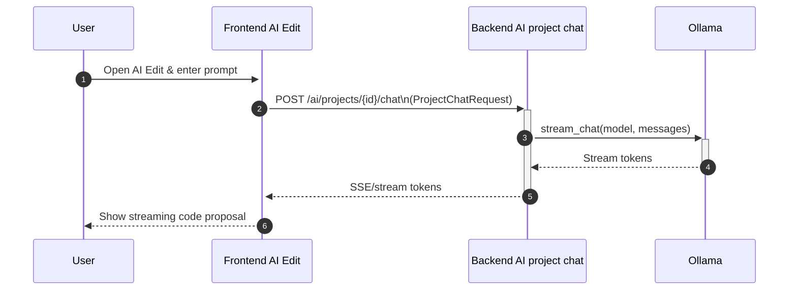
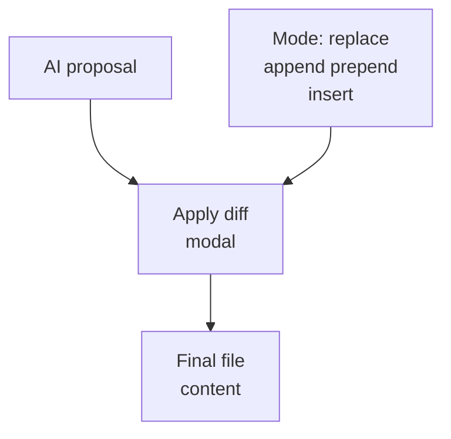

# Project Overview

**Related Files**:
- `README.md`
- `backend/app/main.py`
- `frontend/src/app/app.ts`
- `frontend/src/index.html`
- `.env.example`

**Related Pages**:
- System Architecture Overview
- Core Features
- Quickstart and Local Setup

<details>
<summary>Relevant source files</summary>

The following files were used as context for generating this wiki page:

- [README.md](https://github.com/georgepanfil87/syntx/blob/main/README.md)
- [backend/app/main.py](https://github.com/georgepanfil87/syntx/blob/main/backend/app/main.py)
- [backend/app/schemas/project.py](https://github.com/georgepanfil87/syntx/blob/main/backend/app/schemas/project.py)
- [backend/app/schemas/git.py](https://github.com/georgepanfil87/syntx/blob/main/backend/app/schemas/git.py)
- [backend/app/schemas/ai.py](https://github.com/georgepanfil87/syntx/blob/main/backend/app/schemas/ai.py)
- [backend/app/ai/prompt_builder.py](https://github.com/georgepanfil87/syntx/blob/main/backend/app/ai/prompt_builder.py)
- [frontend/src/app/app.ts](https://github.com/georgepanfil87/syntx/blob/main/frontend/src/app/app.ts)
- [frontend/src/index.html](https://github.com/georgepanfil87/syntx/blob/main/frontend/src/index.html)
- [frontend/src/app/core/i18n/en-dictionary.ts](https://github.com/georgepanfil87/syntx/blob/main/frontend/src/app/core/i18n/en-dictionary.ts)
- [frontend/src/app/features/projects/pages/projects-list/projects-list.html](https://github.com/georgepanfil87/syntx/blob/main/frontend/src/app/features/projects/pages/projects-list/projects-list.html)
- [frontend/src/app/features/projects/components/project-rename-modal/project-rename-modal.ts](https://github.com/georgepanfil87/syntx/blob/main/frontend/src/app/features/projects/components/project-rename-modal/project-rename-modal.ts)
- [frontend/src/app/features/projects/components/git-panel/git-panel.ts](https://github.com/georgepanfil87/syntx/blob/main/frontend/src/app/features/projects/components/git-panel/git-panel.ts)
- [frontend/src/app/features/projects/components/ai-edit-modal/ai-edit-modal.ts](https://github.com/georgepanfil87/syntx/blob/main/frontend/src/app/features/projects/components/ai-edit-modal/ai-edit-modal.ts)
- [frontend/src/app/features/projects/components/apply-diff-modal/apply-diff-modal.ts](https://github.com/georgepanfil87/syntx/blob/main/frontend/src/app/features/projects/components/apply-diff-modal/apply-diff-modal.ts)
- [frontend/src/app/features/landing/components/workspace-preview/workspace-preview.ts](https://github.com/georgepanfil87/syntx/blob/main/frontend/src/app/features/landing/components/workspace-preview/workspace-preview.ts)
- [.env.example](https://github.com/georgepanfil87/syntx/blob/main/.env.example)
</details>

# Project Overview

Syntx is a “local-first AI coding workspace” designed to let users manage projects, edit code, and use AI-assisted tooling (chat, AI edits, semantic search, completions) while keeping code on their own machine. The system is composed of a Python backend (FastAPI-based) providing project, Git, and AI APIs, and an Angular frontend that offers a workspace-style UI with editor, projects list, Git panel, AI edit flows, and integrated terminal and search.  
Sources: [README.md]()  

This page outlines the overall architecture and main runtime characteristics of Syntx: how the backend services are structured, how the frontend application is organized, how data and AI flows move between them, and how configuration ties the system together. It serves as a high-level entry point and connects to more focused topics like AI integration or Git support.  
Sources: [README.md](), [backend/app/main.py](), [frontend/src/app/app.ts](), [frontend/src/index.html]()

---

## High-Level Architecture

Syntx is structured as a classic SPA + API backend application:

- A FastAPI backend with versioned REST endpoints under `/api/v1`, providing:
  - Project CRUD (`Project` schemas).
  - Git operations (status, commits, diffs).
  - AI features: generic chat, project-anchored chat, code completions.
- An Angular single-page app (SPA) served at `/`, which:
  - Manages routing between dashboard, projects list, workspace, and settings.
  - Provides integrated views for editor, Git, AI edit modal, quick search, and terminal.
- Configuration is driven by an `.env` file, with documented variables referenced by the backend and (via flags) exposed in the UI.  
Sources: [README.md](), [backend/app/main.py](), [backend/app/schemas/project.py](), [backend/app/schemas/git.py](), [backend/app/schemas/ai.py](), [frontend/src/app/app.ts](), [frontend/src/index.html](), [.env.example]()

### Top-Level Component & Service Diagram



The browser loads the SPA, which calls the backend over HTTP. The backend persists project and Git data, and calls an Ollama-compatible AI server for chat and completion operations.  
Sources: [README.md](), [backend/app/main.py](), [backend/app/schemas/ai.py]()

---

## Backend Overview

Sources: [backend/app/main.py](), [backend/app/schemas/project.py](), [backend/app/schemas/git.py](), [backend/app/schemas/ai.py](), [backend/app/ai/prompt_builder.py]()

The backend is organized around Pydantic schemas that define wire-level contracts, and a main FastAPI application module (`backend/app/main.py`) that wires those schemas into REST endpoints (the main file is referenced in documentation).  
Sources: [backend/app/main.py](), [backend/app/schemas/project.py]()

### Project API and Data Model

`Project` operations are defined via Pydantic schemas in `backend/app/schemas/project.py`. They encapsulate input validation and field constraints for creating and updating projects.  
Sources: [backend/app/schemas/project.py:1-54]()

Key structures:

| Schema            | Purpose                                   | Key Fields                                         |
|-------------------|-------------------------------------------|---------------------------------------------------|
| `ProjectCreate`   | Request body for creating a project       | `name`, `description`                             |
| `ProjectUpdate`   | Request body for partial project updates  | `name`, `description` (optional)                  |

Sources: [backend/app/schemas/project.py:18-49]()

#### `ProjectCreate`

```python
class ProjectCreate(BaseModel):
    """Request body for `POST /api/v1/projects`."""

    name: str = Field(min_length=1, max_length=PROJECT_NAME_MAX_LENGTH)
    description: str | None = Field(
        default=None,
        max_length=PROJECT_DESCRIPTION_MAX_LENGTH,
    )

    @field_validator("name")
    @classmethod
    def _strip_and_require_non_empty(cls, v: str) -> str:
        ...
```

This schema enforces:

- `name` length: 1–120 characters.
- `description` length: up to 2000 characters.
- `name` is trimmed and must contain non-whitespace characters.
- `description` is trimmed; whitespace-only values are normalized to `None`.  
Sources: [backend/app/schemas/project.py:18-49]()

These rules are mirrored in the frontend’s rename modal validation (see below), ensuring consistent behavior across client and server.  
Sources: [frontend/src/app/features/projects/components/project-rename-modal/project-rename-modal.ts:1-52]()

### Git API

The Git subsystem exposes version-control operations at the project level with schemas in `backend/app/schemas/git.py`.  
Sources: [backend/app/schemas/git.py:1-69]()

Key concepts:

| Schema             | Purpose                                           |
|--------------------|---------------------------------------------------|
| `CommitCreate`     | Request body for creating a commit                |
| `CommitRef`        | Row in commit history timeline                    |
| `CommitDetail`     | Commit including file list                        |
| `StatusResponse`   | Result of workspace vs last commit comparison     |
| `DiffResponse`     | Unified view of file content before/after commit  |

Examples:

```python
class CommitCreate(BaseModel):
    """Body of `POST /api/v1/projects/{id}/git/commit`."""

    message: str = Field(..., min_length=1, max_length=512)
```

```python
class StatusResponse(BaseModel):
    """Response of `GET /api/v1/projects/{id}/git/status`."""

    branch: str = "main"
    commits: int
    last_commit_at: datetime | None
    changed: list[StatusFile]
```

```python
class DiffResponse(BaseModel):
    """Response of `GET /api/v1/projects/{id}/git/diff?commit_id=&path=`.
    """

    path: str
    before: str
    after: str
```

Sources: [backend/app/schemas/git.py:9-17](), [backend/app/schemas/git.py:44-57](), [backend/app/schemas/git.py:69-76]()

The frontend Git panel consumes these responses (see “Frontend Workspace & Git Integration” below).  

### AI API and Context Building

The AI subsystem exposes three main capabilities:

- Generic chat: `POST /api/v1/ai/chat` with `ChatRequest`.
- Project-scoped chat: `POST /api/v1/ai/projects/{project_id}/chat` with `ProjectChatRequest`.
- Code completion: `POST /api/v1/ai/complete` with `CompletionRequest`.  
Sources: [backend/app/schemas/ai.py:1-80]()

Key structures:

| Schema               | Purpose                                                           |
|----------------------|-------------------------------------------------------------------|
| `ChatMessage`        | Single chat turn (`role`, `content`)                              |
| `ChatRequest`        | Chat model + ordered message history                              |
| `ProjectChatRequest` | Project chat with `user_query`, `file_paths`, `history`, options |
| `CompletionRequest`  | Code completion context (`prefix`, `suffix`, `language`)         |

Example fields:

```python
class ProjectChatRequest(BaseModel):
    """Body for `POST /api/v1/ai/projects/{project_id}/chat`."""

    model_config = ConfigDict(frozen=True)

    model: str = Field(
        min_length=1,
        max_length=200,
        description="Ollama model tag, e.g. `qwen2.5-coder:1.5b`.",
    )
    user_query: str = Field(
        min_length=1,
        max_length=CHAT_MESSAGE_MAX_CHARS,
        description="The user's prompt for this turn.",
    )
    file_paths: list[str] = Field(
        default_factory=list,
        max_length=PROJECT_CHAT_MAX_FILE_PATHS,
        description="Project-relative file paths to attach as workspace context.",
    )
    history: list[ChatMessage] = Field(
        default_factory=list,
        max_length=CHAT_HISTORY_MAX_MESSAGES,
        description="Optional prior turns. Server-side persistence lands in STEP 29.",
    )
    session_id: UUID | None = Field(
        ...
```

Sources: [backend/app/schemas/ai.py:48-76]()

`ProjectChatRequest` also validates `file_paths` via a field validator that normalizes paths and rejects invalid ones.  
Sources: [backend/app/schemas/ai.py:1-24]()

#### Prompt Building

`backend/app/ai/prompt_builder.py` constructs the actual prompt structures passed to the Ollama client:

- `_render_snippets(snippets)` formats workspace file snippets as Markdown with per-file fenced blocks, prefixed by `"### Workspace context"`.  
- `build_chat_messages(packet, model)` assembles:
  - A `system` preamble tailored to model family.
  - Optional prior history.
  - A final `user` message that contains rendered workspace context + user query.  

```python
def _render_snippets(snippets: tuple[FileSnippet, ...]) -> str:
    """Format attached files as a markdown block prefixing the user turn.
    """
    parts: list[str] = ["### Workspace context"]
    for snippet in snippets:
        lang = snippet.language or ""
        parts.append(f"\n`{snippet.path}`:\n```{lang}\n{snippet.content}\n```")
    return "\n".join(parts)
```

```python
def build_chat_messages(packet: ContextPacket, *, model: str) -> list[ChatMessage]:
    ...
    if packet.snippets:
        rendered = _render_snippets(packet.snippets)
        user_content = f"{rendered}\n\n{packet.user_query}"
    else:
        user_content = packet.user_query

    messages.append(ChatMessage(role="user", content=user_content))
    return messages
```

Sources: [backend/app/ai/prompt_builder.py:1-32]()

#### AI Flow Diagram



The frontend AI features (chat, AI Edit) construct `ProjectChatRequest` payloads, which the backend converts into a structured chat message sequence that includes workspace context before calling the Ollama server.  
Sources: [backend/app/schemas/ai.py:48-76](), [backend/app/ai/prompt_builder.py:1-32](), [frontend/src/app/features/projects/components/ai-edit-modal/ai-edit-modal.ts:1-80]()

---

## Frontend Application Overview

Sources: [frontend/src/index.html](), [frontend/src/app/app.ts](), [frontend/src/app/core/i18n/en-dictionary.ts](), [frontend/src/app/features/projects/pages/projects-list/projects-list.html](), [frontend/src/app/features/projects/components/project-rename-modal/project-rename-modal.ts](), [frontend/src/app/features/projects/components/git-panel/git-panel.ts](), [frontend/src/app/features/projects/components/ai-edit-modal/ai-edit-modal.ts](), [frontend/src/app/features/projects/components/apply-diff-modal/apply-diff-modal.ts](), [frontend/src/app/features/landing/components/workspace-preview/workspace-preview.ts]()

### Shell and Bootstrapping

The entry HTML file is `frontend/src/index.html`:

- Sets basic metadata and declares `<app-root></app-root>` as the root Angular component.  
Sources: [frontend/src/index.html:1-16]()

```html
<!doctype html>
<html lang="en">
<head>
  <meta charset="utf-8">
  <title>Syntx</title>
  <meta name="description" content="Local-first AI coding workspace. Your code never leaves your machine.">
  <meta name="color-scheme" content="dark light">
  <base href="/">
  <meta name="viewport" content="width=device-width, initial-scale=1">
  <link rel="icon" type="image/svg+xml" href="favicon.svg">
  <link rel="alternate icon" type="image/x-icon" href="favicon.ico">
</head>
<body>
  <app-root></app-root>
</body>
</html>
```

Sources: [frontend/src/index.html:1-16]()

The Angular root module/component (`app.ts`) is referenced as one of the main entry points; it manages routing to the dashboard, projects list, workspace, settings, etc.  
Sources: [frontend/src/app/app.ts]()

### Navigation and Dashboard

The English i18n dictionary defines many UI labels and hints, which reflect the core sections of the application:

- Sidebar: `dashboard`, `projects`, `settings`, `admin`, `metrics`.  
- Dashboard tiles: “Projects”, “Requests”, “p50 latency”, “Success rate”, “Recent projects”, “Quick actions”.  
- Topbar: backend status indicator (“Backend online/offline”).  
Sources: [frontend/src/app/core/i18n/en-dictionary.ts:80-140]()

Example entries:

```ts
'sidebar.workspace': 'Workspace',
'sidebar.dashboard': 'Dashboard',
'sidebar.projects': 'Projects',
'sidebar.settings': 'Settings',
'sidebar.admin': 'Admin',
'sidebar.metrics': 'Metrics',
'topbar.backendStatus.ok': 'Backend online',
'topbar.backendStatus.down': 'Backend offline',
```

Sources: [frontend/src/app/core/i18n/en-dictionary.ts:80-117]()

### Projects List Page

The projects list view is implemented in `projects-list.html` and uses UI elements plus localized strings:

- Tagline & heading: “Projects / Your projects”.
- Subheading: “Each project is a standalone workspace with its own files and chat sessions.”
- Actions:
  - “Import” (ZIP file input that triggers `onImportPicked`).
  - “New project” (opens create flow).  
Sources: [frontend/src/app/features/projects/pages/projects-list/projects-list.html:1-29](), [frontend/src/app/core/i18n/en-dictionary.ts:141-180]()

Snippet:

```html
<header class="flex items-end justify-between gap-3">
  <div>
    <p class="text-xs uppercase ...">{{ i18n.t('projects.tagline') }}</p>
    <h1 class="text-3xl font-semibold mt-1">
      <span class="gradient-text">{{ i18n.t('projects.heading') }}</span>
    </h1>
    <p class="text-sm text-muted-foreground mt-1">
      {{ i18n.t('projects.subheading') }}
    </p>
  </div>
  <div class="flex items-center gap-2">
    <input #importFile type="file" accept=".zip,application/zip" class="hidden" (change)="onImportPicked($event)" />
    <sx-button variant="ghost" (click)="importFile.click()" [disabled]="importing()">
      <sx-icon slot="leading" name="download" class="rotate-180" />
      @if (importing()) {
        {{ i18n.t('projects.importing') }}
      } @else {
        {{ i18n.t('projects.import') }}
      }
    </sx-button>
    <sx-button (click)="openCreate()">
      <sx-icon slot="leading" name="plus" />
      {{ i18n.t('projects.new') }}
    </sx-button>
  </div>
</header>
```

Sources: [frontend/src/app/features/projects/pages/projects-list/projects-list.html:1-29]()

The dictionary further defines messages for lifecycle events: project created, renamed, deleted, imported, import failures, and validation messages.  
Sources: [frontend/src/app/core/i18n/en-dictionary.ts:141-187]()

---

## Frontend Workspace & Git Integration

### Project Rename Modal

The rename modal keeps client-side validation in sync with backend rules from `ProjectCreate`:

- Name required, max 120 chars.
- Description max 2000 chars.
- Trims and only sends changed fields on PATCH requests.  

```ts
protected nameError(): string {
  const c = this.form.controls.name;
  if (!c.touched || !c.errors) return '';
  if (c.errors['required']) return 'Name is required.';
  if (c.errors['maxlength']) return 'Name must be 120 characters or fewer.';
  return '';
}

protected submit(): void {
  const proj = this.project();
  if (!proj || this.form.invalid || this.pending()) {
    this.form.markAllAsTouched();
    return;
  }
  const { name, description } = this.form.getRawValue();
  const trimmedName = name.trim();
  const trimmedDescription = description.trim();

  const changes: { name?: string; description?: string | null } = {};
  if (trimmedName !== proj.name) changes.name = trimmedName;

  const nextDescription = trimmedDescription || null;
  if (nextDescription !== (proj.description ?? null)) {
    changes.description = nextDescription;
  }

  if (Object.keys(changes).length === 0) {
    this.cancel();
    return;
  }
  this.store.dispatch(ProjectsActions.updateProject({ id: proj.id, changes }));
}
```

Sources: [frontend/src/app/features/projects/components/project-rename-modal/project-rename-modal.ts:1-52](), [backend/app/schemas/project.py:18-49]()

#### Rename Flow Diagram



The user opens the modal, edits name/description, the modal dispatches an update action to the store, and the store calls the backend projects API with a minimal changes object.  
Sources: [frontend/src/app/features/projects/components/project-rename-modal/project-rename-modal.ts:1-52](), [backend/app/schemas/project.py:18-49]()

### Git Panel

The Git panel component (`git-panel.ts`) manages:

- Loading Git status via `this.gitApi.status(projectId)` → mapped to `StatusResponse` on the backend.  
- Loading commit log via `this.gitApi.log(projectId, 100)` → mapped to `CommitListResponse`.  
- Loading per-file diffs via `this.gitApi.diff(pid, cid, path)` → mapped to `DiffResponse`.  
Sources: [frontend/src/app/features/projects/components/git-panel/git-panel.ts:40-104](), [backend/app/schemas/git.py:1-76]()

It also exposes helpers:

- `formatTime(iso: string): string` – formats timestamps for display.
- `languageFromPath(path: string)` – infers language from file extension, shared with other components.  

Snippet:

```ts
private loadStatus(projectId: string): void {
  this.loadingStatus.set(true);
  this.gitApi
    .status(projectId)
    .pipe(takeUntilDestroyed(this.destroyRef))
    .subscribe({
      next: (s) => {
        this.statusData.set(s);
        this.loadingStatus.set(false);
      },
      error: () => this.loadingStatus.set(false),
    });
}
```

```ts
protected formatTime(iso: string): string {
  const d = new Date(iso);
  if (!Number.isFinite(d.getTime())) return iso;
  return new Intl.DateTimeFormat(undefined, {
    month: 'short',
    day: 'numeric',
    hour: '2-digit',
    minute: '2-digit',
  }).format(d);
}
```

Sources: [frontend/src/app/features/projects/components/git-panel/git-panel.ts:40-75](), [frontend/src/app/features/projects/components/git-panel/git-panel.ts:104-116]()

#### Git Panel Data Flow



The Git panel triggers status/log/diff requests through a dedicated Git API service, which calls the backend Git endpoints defined by the schemas in `backend/app/schemas/git.py`.  
Sources: [frontend/src/app/features/projects/components/git-panel/git-panel.ts:40-104](), [backend/app/schemas/git.py:1-76]()

The i18n dictionary also defines user-facing Git text:

- Titles and tab labels: “Version control”, “Status”, “History”.
- Change types: “Added”, “Modified”, “Deleted”.
- Commit UI text: placeholders, buttons, success/error messages.  
Sources: [frontend/src/app/core/i18n/en-dictionary.ts:188-243]()

---

## AI Edit & Apply Diff Flows

### AI Edit Modal

The AI Edit modal (`ai-edit-modal.ts`) allows users to describe a change for the currently open file and streams back a complete file replacement from the AI model.

Key aspects:

- Determines language hint and placeholder text based on file extension.  
- Builds a composed prompt that instructs the model to:

  - Edit a specific file path.
  - Apply the user’s requested change.
  - Return the complete new content in a single fenced code block, without commentary.  

- Streams tokens from `chatApi.streamProjectChat(projectId, { ... })`.  
- Extracts the code block body from the streamed text using `extractCodeBody`.  

Prompt composition:

```ts
const userPrompt = this.prompt().trim();
const composed =
  `You are editing the file \`${f.path}\`.\n\n` +
  `The user wants this change:\n${userPrompt}\n\n` +
  `Output the COMPLETE new content of \`${f.path}\` inside a single ` +
  "triple-backtick fenced code block. Do not include any explanation, " +
  'commentary, or text outside the code block.';
```

Sources: [frontend/src/app/features/projects/components/ai-edit-modal/ai-edit-modal.ts:1-80]()

Language detection helpers:

```ts
const EXT: Record<string, string> = {
  ts: 'typescript', tsx: 'typescript',
  js: 'javascript', jsx: 'javascript',
  py: 'python', rs: 'rust', go: 'go', java: 'java',
  html: 'html', css: 'css', scss: 'scss',
  json: 'json', md: 'markdown', yml: 'yaml', yaml: 'yaml',
  sh: 'shell', sql: 'sql', xml: 'xml', toml: 'ini',
};
function languageHint(path: string): string {
  const dot = path.lastIndexOf('.');
  if (dot < 0) return 'plaintext';
  return EXT[path.slice(dot + 1).toLowerCase()] ?? 'plaintext';
}
```

Sources: [frontend/src/app/features/projects/components/ai-edit-modal/ai-edit-modal.ts:80-111]()

Code extraction helper:

```ts
function extractCodeBody(raw: string): string {
  if (!raw) return '';
  const fence = /```[^\n]*\n([\s\S]*?)(?:\n```|$)/;
  const m = fence.exec(raw);
  if (m) return m[1] ?? '';
  return raw;
}
```

Sources: [frontend/src/app/features/projects/components/ai-edit-modal/ai-edit-modal.ts:60-69]()

The modal state machine has phases: `'prompt'`, `'streaming'`, `'review'`, `'error'`, and resets when closed. It also handles missing project context errors.  
Sources: [frontend/src/app/features/projects/components/ai-edit-modal/ai-edit-modal.ts:1-80]()

The i18n dictionary provides AI Edit-specific strings used in this component:

- Title variations: `aiEdit.titleFor` / `aiEdit.titleGeneric`.
- Labels, button text, hints, and error messages.  
Sources: [frontend/src/app/core/i18n/en-dictionary.ts:244-278]()

#### AI Edit Flow Diagram (Sequence)



The user initiates an AI edit, the frontend calls the project chat endpoint, the backend calls the AI server, and streamed tokens are assembled and processed client-side.  
Sources: [frontend/src/app/features/projects/components/ai-edit-modal/ai-edit-modal.ts:1-80](), [backend/app/schemas/ai.py:48-76](), [backend/app/ai/prompt_builder.py:1-32]()

### Apply Diff Modal

Once an AI edit or other proposal exists, the Apply Diff modal (`apply-diff-modal.ts`) lets the user choose how to apply it:

- Modes: `replace`, `append`, `prepend`, `insert`.  
- `exists` checks if the target path already exists in the file tree.
- `lineCount` computes the existing file’s line count, including for insert mode bounds.
- `finalContent` computes the resulting file content given current file, proposed code, mode, and insertion line.  

Key logic:

```ts
protected readonly modes = [
  {
    value: 'replace',
    labelKey: 'applyDiff.modeReplace',
    descriptionKey: 'applyDiff.modeReplaceDesc',
  },
  {
    value: 'append',
    labelKey: 'applyDiff.modeAppend',
    descriptionKey: 'applyDiff.modeAppendDesc',
  },
  {
    value: 'prepend',
    labelKey: 'applyDiff.modePrepend',
    descriptionKey: 'applyDiff.modePrependDesc',
  },
  {
    value: 'insert',
    labelKey: 'applyDiff.modeInsert',
    descriptionKey: 'applyDiff.modeInsertDesc',
  },
];
```

```ts
protected readonly finalContent = computed<string>(() => {
  const proposed = this.proposal()?.proposed ?? '';
  const current = this.current();
  switch (this.mode()) {
    case 'append':
      return current ? `${current}\n${proposed}` : proposed;
    case 'prepend':
      return current ? `${proposed}\n${current}` : proposed;
    case 'insert': {
      if (!current) return proposed;
      const lines = current.split('\n');
      const at = Math.max(0, Math.min(this.insertLine(), lines.length));
      lines.splice(at, 0, proposed);
      return lines.join('\n');
    }
    default:
      return proposed;
  }
});
```

Sources: [frontend/src/app/features/projects/components/apply-diff-modal/apply-diff-modal.ts:1-44](), [frontend/src/app/core/i18n/en-dictionary.ts:279-307]()

The i18n dictionary supplies all labels and descriptions for these modes, including “Create file”, “Replace file”, “Append to file”, etc.  
Sources: [frontend/src/app/core/i18n/en-dictionary.ts:279-307]()

#### Apply Diff Logic Diagram



The modal combines the proposal with the chosen mode and existing content to produce the final file content to write.  
Sources: [frontend/src/app/features/projects/components/apply-diff-modal/apply-diff-modal.ts:1-44]()

---

## Workspace Preview and UX Cues

The `workspace-preview` component is a static visual representation of the workspace used for the marketing/landing surface. It:

- Renders a mock project tree, an editor section showing CSS code, and a chat panel showing an example refactoring request and summarization by AI.  
- Uses consistent styling cues such as status badges (“unsaved”, “edited”) and a pseudo-stats footer (e.g., “312 chars · 14 lines”).  

Snippet:

```html
<div class="rounded-md border border-border bg-card flex flex-col overflow-hidden">
  <div class="flex items-center justify-between px-3 py-2 border-b border-border text-xs">
    <span class="font-mono text-muted-foreground">src/app/styles.css</span>
    <span class="inline-flex items-center gap-1 text-[10px] px-1.5 py-0.5 rounded-full bg-primary/12 text-primary border border-primary/30">unsaved</span>
  </div>
  <div class="flex-1 p-4 text-sm font-mono leading-relaxed">
    <p class="text-muted-foreground/70">/* path: src/app/styles.css */</p>
    <p><span class="text-primary">.hero</span> {{ '{' }}</p>
  </div>
  <div class="flex items-center justify-between px-3 py-1.5 border-t border-border text-[10px] text-muted-foreground font-mono">
    <span>312 chars · 14 lines</span>
    <span>edited</span>
  </div>
</div>
```

Sources: [frontend/src/app/features/landing/components/workspace-preview/workspace-preview.ts:40-83]()

The chat portion of the preview demonstrates the code + chat interplay that is central to the workspace:

```html
<div class="self-end ml-auto rounded-xl bg-primary/15 border border-primary/30 px-3 py-2 max-w-[85%]">
  refactor <span class="text-primary">@src/app/styles.css</span> to use design tokens
</div>
<div class="rounded-xl bg-secondary border border-border px-3 py-2 max-w-[90%] space-y-1.5">
  <p>
    Renamed brand colors to
    <code class="font-mono text-primary">var(--primary)</code> and the headline
    gradient to <code class="font-mono text-primary">var(--gradient-text)</code>.
  </p>
  ...
</div>
```

Sources: [frontend/src/app/features/landing/components/workspace-preview/workspace-preview.ts:83-120]()

---

## Configuration and Environment

`.env.example` documents the environment variables expected by the backend:

- Backend server configuration (host/port).
- Integration flags for AI features and web search (referenced in AI schemas via `WEB_SEARCH_ENABLED` notes).
- DB connection and storage settings.  

Although the file content is not fully reproduced here, it is the canonical reference for configuring a Syntx instance; the settings page in the frontend notes that “Server flags are read-only — change them via the backend .env.”  
Sources: [.env.example](), [frontend/src/app/core/i18n/en-dictionary.ts:118-140]()

Example settings text:

```ts
'settings.subheading': 'Per-browser preferences, persisted in localStorage. Server flags are read-only — change them via the backend .env.',
```

Sources: [frontend/src/app/core/i18n/en-dictionary.ts:118-140]()

---

## Summary

Syntx is a local-first AI coding workspace composed of:

- A FastAPI backend that exposes well-typed project, Git, and AI APIs using Pydantic schemas (`project.py`, `git.py`, `ai.py`) and constructs structured AI prompts with workspace-aware context (`prompt_builder.py`).  
- An Angular SPA that provides a cohesive workspace UI with projects management, Git panel, AI Edit + Apply Diff flows, quick open and chat, and a terminal, bootstrapped via `index.html` and `app.ts` and localized through `en-dictionary.ts`.  
- A clear separation between API contracts and UI behaviors: e.g., project rename validation mirrors backend constraints; Git panel and AI Edit use strongly defined backend schemas; Apply Diff uses deterministic content transformation logic.  
- Central configuration via `.env`, surfaced read-only in the settings UI.

This overview should act as a starting point for deeper documentation pages on individual subsystems such as [AI Integration](#) or [Git Version Control](#), grounded in the same source files and interfaces described here.  
Sources: [README.md](), [backend/app/schemas/project.py:18-49](), [backend/app/schemas/git.py:1-76](), [backend/app/schemas/ai.py:1-80](), [backend/app/ai/prompt_builder.py:1-32](), [frontend/src/app/core/i18n/en-dictionary.ts:80-140](), [frontend/src/app/features/projects/components/git-panel/git-panel.ts:40-116](), [frontend/src/app/features/projects/components/ai-edit-modal/ai-edit-modal.ts:1-111](), [frontend/src/app/features/projects/components/apply-diff-modal/apply-diff-modal.ts:1-44]()
